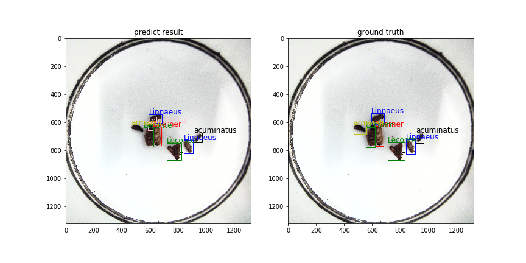

# AI-Insects-Challenge
[AI识虫练习赛](https://aistudio.baidu.com/aistudio/competition/detail/24)第二名代码分享

## 简介

本赛题是一个标准的目标检测任务，主要对纯色器皿中的七种虫子的位置和类别进行检测。本解决方案主要包含了两个模块，分别是YoloV3的目标检测模块，以及后置的SENet分类矫正模块。两个模块直接串联，先通过YoloV3得出检测框和分类结果，然后将检测框裁剪出来使用分类网络进一步矫正分类结果，最后通过一个改进的NMS方案得到最终结果。


注：本代码均使用paddlepaddle 1.6.0 的静态网络搭建

### 图像增广方案

- MixUp （前期训练有效提高，后期精调建议不用）

- 随机旋转图像

  旋转从理论上来说很有用，但是旋转之后的真实box会变大，不再紧贴目标，尤其是45度旋转的时候，暂时没有找到更优的解决方案。前两天又看到opencv中貌似有类似的处理，回头试一下再改进。

- 随机色彩变换

  亮度、对比度、饱和度等色彩相关变换

- 随机扩充

  将图像外围扩大1-4倍，这样可以缩小原始的box，可以优化小目标的检测

- 随机裁剪

- 随机缩放 （这里的随机主要是缩放插值方法的随机）

- 随机翻转 （水平翻转、垂直翻转）

- 图片、真实框归一化处理

- 随机多尺度训练

  每个batch输入不同size的图片，可以得到不同的语义特征，能加强训练效果

### 检测模块

- Detector — `YoloV3`

  使用`YoloV3`作为本方案的目标检测器，`YoloV3`借鉴了许多一阶段和二阶段目标检测方法的优秀解决方案，如特征金字塔、多尺度预测、更优的BackBone等等，使其在一阶段目标检测算法中属于上乘之选。

- BackBone — `ResNet50-vd-dcn`

  本方案中使用`ResNet50`作为骨干网络，替换原始的DarkNet53，同时选用第四个变种vd，保证信息的传递不丢失，最后根据[PaddleDetection](https://github.com/PaddlePaddle/PaddleDetection)的指导，添加了一层可变形卷积DCN，用于捕捉特征图中有物体的区域。

### 后置分类矫正模块

- Network — `SENet` 

  SENet 在卷积时会对每个特征图计算一个权重，以突出对结果增益高的特征图，从而进一步增强分类效果

- BackBone — `ResNet50`

- 输入

  将gt_bbox图或者检测框的图抠出来作为网络的输入

- 输出

  分类结果 + 分类置信度

### 后置改进NMS

1. 判断同类别的两个Box，如果`IOU`大于阈值，将两个Box的外接矩形作为输出Box，并选取二者之中Score大的作为最后的置信度；如果`IOU`小于阈值，两个Box均保留；
2. 重复1中的步骤，不过`IOU`计算方法和阈值替换一下，`IOU`计算方法更换为交集面积占两个Box的面积之比之中大的一个，主要过滤一个类别中的局部位置被重复检测，即大框包含小框，此时阈值尽量调整高一些，避免相隔太近的两个Box被过滤掉；
3. 剔除部分置信度得分过低的结果。


## 运行准备

### 关键环境

- paddlepaddle-gpu == 1.6.1
- opencv-python == 3.2.0.8
- numpy == 1.16.2

### 数据

- AI识虫检测数据

  这里没有为大家准备数据，熟悉的人可以直接在AIStudio中拷贝数据，以老师给我们的目录为例，直接运行以下命令

  ```shell
  !unzip -d insects_detection/data/ insects.zip
  ```

  将数据集解压到本项目的`data`目录下即可。

- 分类矫正网络训练数据

  AI识虫数据解压完成后，直接运行命令即可直接生成分类网络的训练数据和验证数据

  ```shell
  python classification/generate_cls_data.py
  ```

### 预训练参数

本方案使用的预训练参数均来自百度paddlepaddle模型库

YoloV3预训练：[object365预训练参数](https://paddlemodels.bj.bcebos.com/object_detection/yolov3_r50vd_dcn.tar)

SENet预训练：[ImageNet预训练参数](https://paddle-imagenet-models-name.bj.bcebos.com/SE_ResNet50_vd_pretrained.tar)

将下载好的预训练参数解压到pretrain_weights下，分别形成 `pretrain_weights/yolov3_resnet50vd_dcn` 和 `pretrain_weights/se_resnet50_vd` 两个模型目录

### 模型参数

此处提供经过训练和进一步调整之后的参数，不一定完全训练充分了，有能力的同学可以尝试进一步训练。（下载地址为临时地址，不保证一直在线）。地址分别是 [YoloV3训练参数](http://47.103.216.113:8080/yolov3_resnet50vd_dcn_insects.zip) 和 [SENet训练参数](http://47.103.216.113:8080/se_resnet50_vd.zip)

将下载好的参数解压到 `models`文件夹，分别形成 `models/yolov3_resnet50vd_dcn` 和 `models/se_resnet50_vd` 两个目录

注：这里使用的都是Paddle的静态网络构建方式，所以对应的模型参数也都是静态网络才能读取的模型参数，如果需要将静态网络参数加载为动态网络参数，后续我会开源一个加载工具，目前正在优化中，敬请期待...

## 运行方式

相关参数都在对应的文件下，在直接运行前，可以查看相关参数，进行调整更改后运行。

- 训练YoloV3网络

  直接运行`train_yolo.py`，训练时会将模型保存到 `models`文件夹下，如果需要在上述模型上继续训练，可以将参数中的`pretrain_weights`参数更改为上述训练好的参数，同时将 `ignore_weights`更改为空列表

  ```shell
  python detection/train_yolo.py
  ```

  

- 评估和测试YoloV3

  评估会直接输出`mAP`值，测试会输出一个`json`文件

  ```shell
  # 评估
  python detection/eval_yolo.py
  # 测试
  python detection/infer_yolo.py
  ```

  

- 训练SENet分类网络

  相关说明跟检测网络相似，修改参数后，直接运行`train_cls.py`即可

  ```shell
  python classification/train_cls.py
  ```

  

- 评估和测试SENet

  说明同上，评估会直接输出准确率和损失。单独运行分类测试前，请先运行YoloV3的测试，因为此处测试会使用检测结果的`json`文件.

  ```shell
  # 评估
  python classification/eval_cls.py
  # 测试
  python classification/infer_cls.py
  ```

  

- End-to-End检测

  可以在`run.py`中修改相关的执行参数，然后直接运行即可，得到最终的输出文件 `pred_results.json`

  ```shell
  python run.py
  ```


## 结果

这里展示了一下本方案在验证集和测试集中的表现效果。（ps: 这里删除了一些比赛刷分用的代码，所以结果没有100）

|        | YoloV3检测结果 | SENet分类结果 | 后置改进NMS处理 |
| ------ | -------------- | ------------- | --------------- |
| 验证集 | 95.3091        | 97.4154       | 99.9189         |
| 测试集 | 95.3675        | 95.5866       | 99.9810         |

  另外，经过对测试集结果的对比，发现上述测试集检测结果中，检测出了测试集中的三个漏标数据，分别是测试集图片`2547.jpeg`、`2558.jpeg`、`3073.jpeg`。所以，此次数据集有不少漏标错标的情况，如果能矫正这些错误，也许能直接让模型预测出更好的结果。



